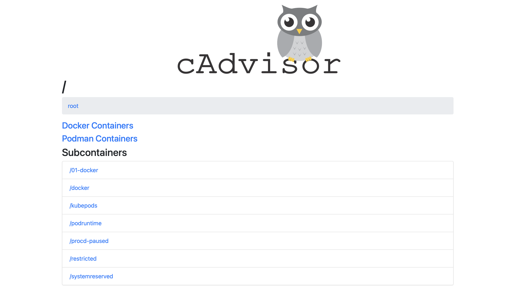
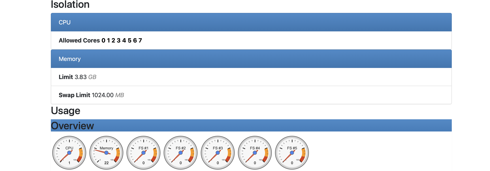
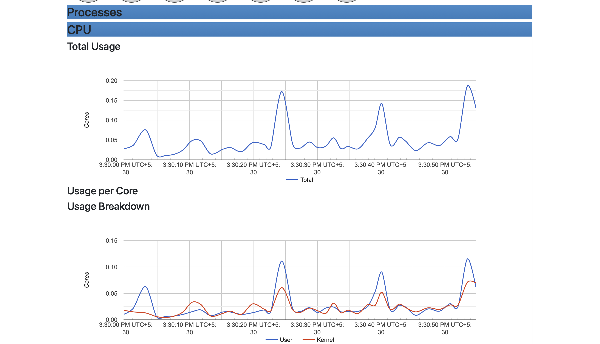
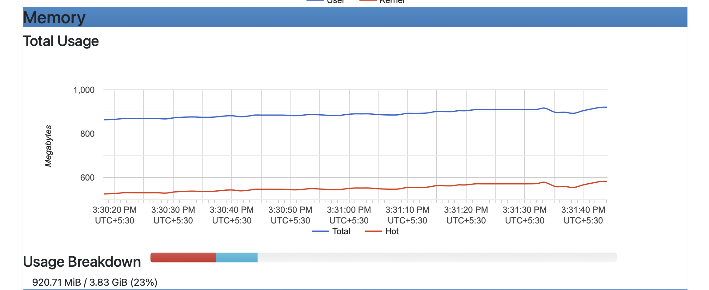
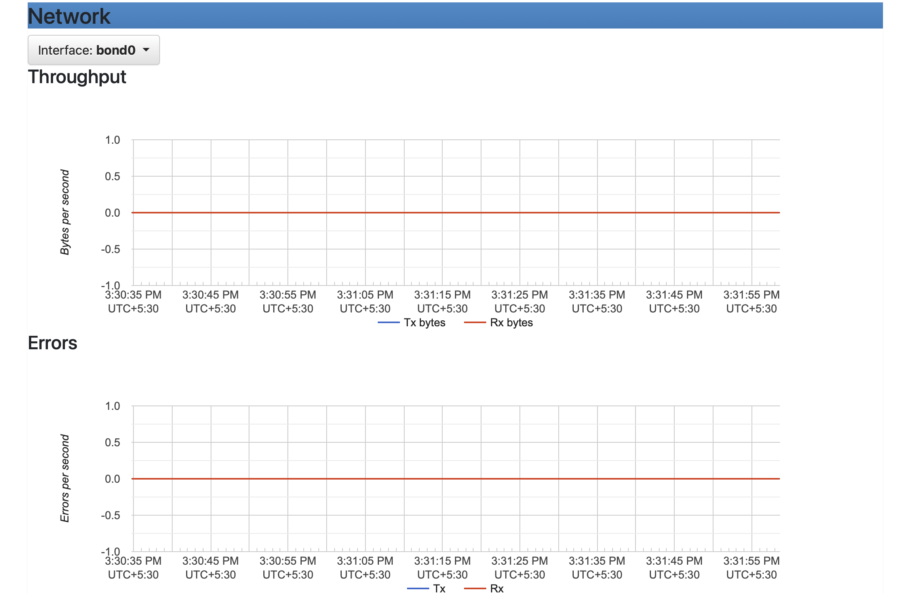
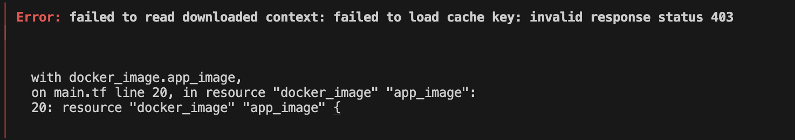

# DevOps_Simple_Project
A simple DevOps project made on Nodejs 
Uses Docker for Containerizaton and Terraform for Iac 

The Nodejs WebApp is a basic webapp

Clone this repo: ```git clone https://github.com/Sameer-Shaikh-169/DevOps_Simple_Project.git```

Install dependencies using npm javascript package manager: ```npm install```

Start node server : ```npm start```

url: ```http://localhost:3000```

## Screenshot


This was to check if the website is working in your Machine

Now, cd in the node file and use : ```code .```

Which will open the Vscode where it will be easier to run Docker and Terraform

I've used cAdvisor with Docker Compose for monitoring

To run the Docker Compose File use this Command : ```docker-compose up --build```

Here are the cAdvisor monitoring images:






If you want to run only Docker use these Commands : ```docker build -t test```  (test is the image name you can name it wahtever you want) then use the command ```docker run -p 3000:3000 test``` (test is the name of the docker image we built)

To run Terraform script first initialize with : ```terraform init```

Then apply the Terraform Configuration using : ```terraform apply```

To stop and remove resources created by Terraform use : ```terraform destroy```

Delete the Docker Cotainers before applying Terraform Configuration using: ```docker rm (conatiner name/id)```

I've Encountered 3-4 Error's in Terraform I was able to solve all of them except 1

This was the Error:



